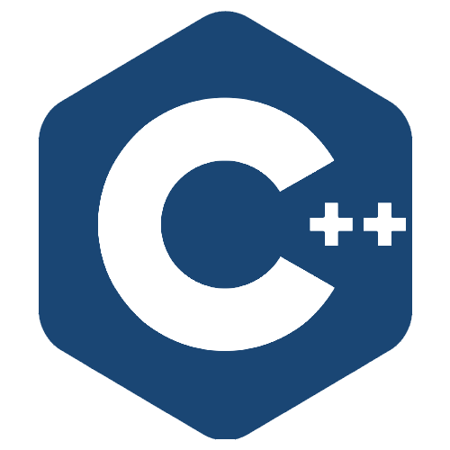

# <b>Hi there</b> 

##  <b>My Name is Aimad BAHDIR</b>

### 
I've been always obsessed with researching new technologies, In my early beginnings I started designing and then discovered the world of coding, I loved it.

### 
Since front-end development combines these two worlds, it was the best option for me, then I decided to learn many related technologies like:

 

    
    
    
    
    
    
    
    

 

### 
Lately mobile development got my attention, so I started building mobile apps using: 

    
    

### <b>Here are some other technologies I have experience with :</b>
 

    
    
    
    
    
    
    

 
 

## 
<b>For more informations</b>

    
    &nbsp;&nbsp;&nbsp;
    

 
 