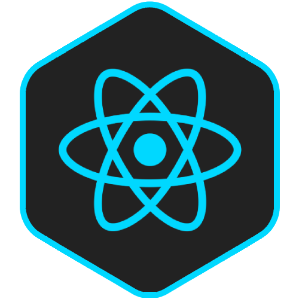
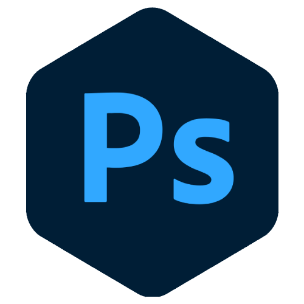

# <b>Hi there</b> 

<h2> My Name is Aimad BAHDIR</h2>

**
I have always been passionate about exploring new technologies. In the early stages of my career, I began designing and eventually discovered the world of coding, which I loved.
**
**
 Since front-end development combines design and coding, it was the perfect fit for me. I have since focused on learning various related technologies, such as :
**

    
    
    
    
    
    
    
    

**
I have also become interested in mobile development and have started building mobile apps using : 
**

    
    

### <b>Additionally, I have experience with technologies such as :</b>
 

    
    
    
    
    
    
    
     
    
    
    
    
    
    

 

### <h3 align="center"><b>For more informations</b></h3>
 

    
    &nbsp;&nbsp;
    

 