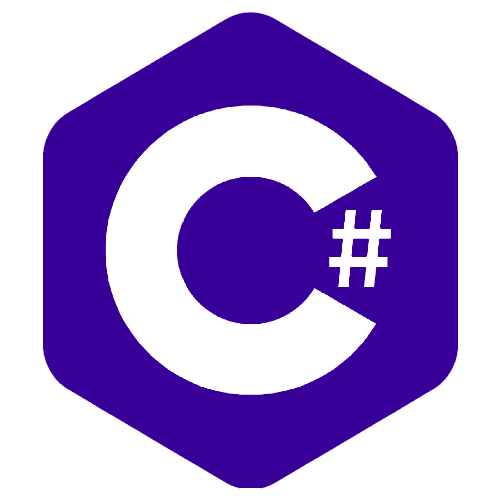

# <b>Hi there</b> 

<h2> My Name is Aimad BAHDIR</h2>

**
I've been always obsessed with researching new technologies, In my early beginnings I started designing and then discovered the world of coding, I loved it.
**
**
Since front-end development combines these two worlds, it was the best option for me, then I decided to learn many related technologies like:
**
 

    
    
    
    
    
    
    
    

 

**
Lately mobile development got my attention, so I started building mobile apps using: 
**

    
    

### <b>Here are some other technologies I have experience with :</b>
 

    
    
    
    
    
    
    

 
 

### <h3 align="center"><b>For more informations</b></h3>
 

    
    &nbsp;&nbsp;&nbsp;
    

 
 